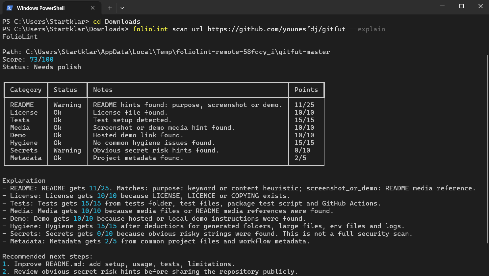

# FolioLint

FolioLint is a local Python CLI that checks whether a repository is prepared for public presentation. It focuses on portfolio and showcase readiness: README, setup, usage, tests, license, screenshots, demo hints, repository hygiene, large files and obvious secret risk hints.

FolioLint helps you find boring but important repo presentation issues before sharing a project publicly.

It is not a code quality tool, not a security scanner, not an AI tool and not a recruiter oracle. The goal is a repeatable local checklist with transparent scoring.



## What It Checks

- README.md presence and common showcase sections
- License file presence
- Test folder, test files and CI hints
- Screenshots or demo media
- Hosted demo links or local start instructions
- Generated folders, large files, `.env` files and logs
- Obvious secret risk strings
- Common project metadata

## What It Is Not

- No AI module
- No API key
- No internet access needed
- No automatic README or license editing
- No claim that a project is good or bad
- No replacement for real secret scanning

## Local Installation

Use Python 3.11 or newer. Run the install command from the FolioLint project folder, where `pyproject.toml` is located.

If you downloaded or cloned FolioLint into another folder, change the `cd` command to that folder. For example, if FolioLint is in your Downloads folder on Windows, use `cd "$env:USERPROFILE\Downloads\FolioLint"` in PowerShell.

On Windows PowerShell:

```powershell
git clone https://github.com/AleksZyro/FolioLint.git
cd FolioLint
python -m venv .venv
.\.venv\Scripts\Activate.ps1
python -m pip install -e ".[dev]"
```

If PowerShell blocks activation scripts, run this once in the same terminal and then activate again:

```powershell
Set-ExecutionPolicy -Scope CurrentUser RemoteSigned
```

On Windows Command Prompt (`cmd.exe`):

```bat
git clone https://github.com/AleksZyro/FolioLint.git
cd FolioLint
py -3.11 -m venv .venv
.venv\Scripts\activate.bat
py -m pip install -e ".[dev]"
```

On macOS or Linux:

```bash
git clone https://github.com/AleksZyro/FolioLint.git
cd FolioLint
python -m venv .venv
source .venv/bin/activate
python -m pip install -e ".[dev]"
```

## Usage

The `foliolint` commands are the same on Windows, macOS and Linux:

```text
foliolint scan .
foliolint scan . --format json
foliolint scan . --format markdown
foliolint scan . --strict
foliolint scan . --fail-under 75
```

The dot in `foliolint scan .` means "scan the folder I am currently in". To scan a different local project, replace the dot with that project's folder path. Paths with spaces should be wrapped in quotes.

Local path examples:

```powershell
foliolint scan ..\SortLab --explain
foliolint scan ..\BESP2074 --no-score
foliolint scan "C:\Users\Example\Downloads\My Project" --explain
```

```bash
foliolint scan ../SortLab --explain
foliolint scan ../BESP2074 --no-score
foliolint scan "/Users/example/Downloads/My Project" --explain
```

Remote scans for public GitHub repositories:

```text
foliolint scan-url https://github.com/AleksZyro/FolioLint --explain
foliolint scan-url https://github.com/OWNER/REPO --format json
foliolint scan-url https://github.com/OWNER/REPO --format markdown
foliolint scan-url https://github.com/OWNER/REPO --branch main
foliolint scan-url https://github.com/OWNER/REPO --max-download-mb 100
```

Use `scan-url` when you want to check a public GitHub repository without manually cloning or keeping a copy of it.

`scan PATH` checks a folder that already exists on your computer and does not need internet access. `scan-url URL` downloads a public GitHub repository as a temporary ZIP file, checks it locally, and deletes the downloaded files afterwards. The temporary files are created in your operating system's temp folder, not in the folder where you run FolioLint. It does not use a GitHub API key. Private repositories are not supported by `scan-url`.

To protect disk space, `scan-url` stops downloads above 50 MB by default. Use `--max-download-mb` only when you intentionally want to scan a larger repository.

Local demo command:

```text
foliolint scan . --no-score
```

## Example Output

```text
FolioLint

Path: .
Score: 74/100
Status: Needs polish

Category          Status       Notes
README            OK           Purpose, setup and usage found
License           Warning      No LICENSE file found
Tests             OK           pytest tests detected
Media             Warning      No screenshots or demo media found
Demo              OK           Local start instructions found
Hygiene           Warning      _site folder detected
Secrets           OK           No obvious secret patterns found
Metadata          OK           pyproject.toml found
```

JSON output is available for automation:

```json
{
  "score": 90,
  "status": "Showcase-ready",
  "checks": [
    {
      "category": "README",
      "status": "ok",
      "message": "README hints found: purpose, setup, usage, tests, status or limitations, screenshot or demo.",
      "points": 25,
      "max_points": 25
    }
  ],
  "recommendations": []
}
```

Markdown output is available for comments, issue descriptions or CI summaries:

```bash
foliolint scan . --format markdown
```

## Score

The score is a public showcase readiness score from 0 to 100. It is not an objective project quality score.

- 0-49: Not ready
- 50-74: Needs polish
- 75-89: Almost showcase-ready
- 90-100: Showcase-ready

Run with `--explain` to see why category points were given or deducted. README explanations include matching headings, code commands or keyword heuristics.

Run with `--no-score` to hide the score completely. Run with `--fail-under 75` when CI should fail below a chosen readiness threshold.

Full scoring rules are documented in [docs/scoring.md](docs/scoring.md).

## Configuration

Create an optional `.foliolint.toml` in the scanned repository:

```toml
[ignore]
paths = ["dist", "docs/assets/large-demo.mp4"]
checks = ["demo-link"]

[thresholds]
large_file_mb = 10

[project]
type = "local-app"
status = "prototype"
```

Ignored paths are skipped by file-based checks. Ignored checks appear as ignored and do not affect the score.

## Limits

The checks are deterministic heuristics. They cannot understand full project context. README quality, security posture and portfolio value still need human judgement.

More detail is in [docs/limitations.md](docs/limitations.md).

For examples of warnings that can be safe to ignore, see [docs/warnings.md](docs/warnings.md).

## Real Repository Smoke Tests

FolioLint was tested against real local portfolio repositories during MVP development:

```bash
foliolint scan ../SortLab --explain
foliolint scan ../BESP-Balkan-Economy-Simulation-Player- --explain
```

These runs helped improve noisy warnings around generated folders, dependency folders and obvious secret-risk hints.

## Roadmap

- Improve wording based on public feedback
- Add more project-type-aware checks
- Add better false-positive handling
- Add optional CI examples
- Keep the MVP local and rule-based

## Feedback

Feedback is welcome, especially confusing results, false positives, missing checks and unclear scoring. See [docs/feedback.md](docs/feedback.md).

## FAQ

**Q: Is this an AI tool?**  
A: No. The MVP is fully rule-based and runs locally.

**Q: Is the score objective?**  
A: No. It is a transparent readiness score for public presentation, not a universal project quality score.

**Q: Why not just use a checklist?**  
A: A checklist is useful. This tool automates common checks so they can be repeated locally or in CI.

**Q: Is this a security scanner?**  
A: No. It only detects obvious risky patterns and should not replace proper secret scanning.

**Q: Will this make people optimise for fake portfolio points?**  
A: The tool intentionally explains limitations and supports `--no-score`. The goal is clarity and safer public sharing, not gaming.
