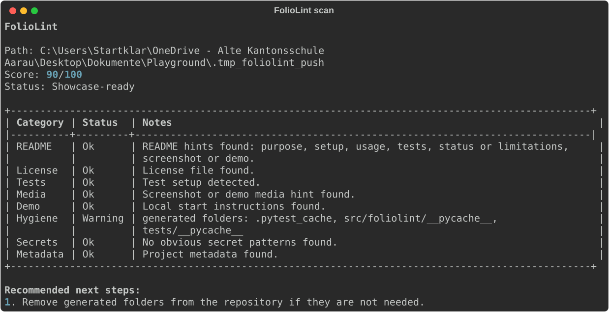

# FolioLint

FolioLint is a local Python CLI that checks whether a repository is prepared for public presentation. It focuses on portfolio and showcase readiness: README, setup, usage, tests, license, screenshots, demo hints, repository hygiene, large files and obvious secret risk hints.

It is not a code quality tool, not a security scanner, not an AI tool and not a recruiter oracle. The goal is a repeatable local checklist with transparent scoring.



## What It Checks

- README.md presence and common showcase sections
- License file presence
- Test folder, test files and CI hints
- Screenshots or demo media
- Hosted demo links or local start instructions
- Generated folders, large files, `.env` files and logs
- Obvious secret risk strings
- Common project metadata

## What It Is Not

- No AI module
- No API key
- No internet access needed
- No automatic README or license editing
- No claim that a project is good or bad
- No replacement for real secret scanning

## Local Installation

Use Python 3.11 or newer.

```bash
python -m venv .venv
source .venv/bin/activate
pip install -e ".[dev]"
```

On Windows PowerShell:

```powershell
python -m venv .venv
.\.venv\Scripts\Activate.ps1
pip install -e ".[dev]"
```

## Usage

```bash
foliolint scan .
foliolint scan ../PathLab --explain
foliolint scan ../BESP2074 --no-score
foliolint scan . --format json
foliolint scan . --strict
```

Local demo command:

```bash
foliolint scan . --no-score
```

## Example Output

```text
FolioLint

Path: .
Score: 74/100
Status: Needs polish

Category          Status       Notes
README            OK           Purpose, setup and usage found
License           Warning      No LICENSE file found
Tests             OK           pytest tests detected
Media             Warning      No screenshots or demo media found
Demo              OK           Local start instructions found
Hygiene           Warning      _site folder detected
Secrets           OK           No obvious secret patterns found
Metadata          OK           pyproject.toml found
```

## Score

The score is a public showcase readiness score from 0 to 100. It is not an objective project quality score.

- 0-49: Not ready
- 50-74: Needs polish
- 75-89: Almost showcase-ready
- 90-100: Showcase-ready

Run with `--explain` to see why category points were given or deducted. Run with `--no-score` to hide the score completely.

Full scoring rules are documented in [docs/scoring.md](docs/scoring.md).

## Configuration

Create an optional `.foliolint.toml` in the scanned repository:

```toml
[ignore]
paths = ["dist", "docs/assets/large-demo.mp4"]
checks = ["demo-link"]

[thresholds]
large_file_mb = 10

[project]
type = "local-app"
status = "prototype"
```

Ignored paths are skipped by file-based checks. Ignored checks appear as ignored and do not affect the score.

## Limits

The checks are deterministic heuristics. They cannot understand full project context. README quality, security posture and portfolio value still need human judgement.

More detail is in [docs/limitations.md](docs/limitations.md).

For examples of warnings that can be safe to ignore, see [docs/warnings.md](docs/warnings.md).

## Real Repository Smoke Tests

FolioLint was tested against real local portfolio repositories during MVP development:

```bash
foliolint scan ../SortLab --explain
foliolint scan ../BESP-Balkan-Economy-Simulation-Player- --explain
```

These runs helped improve noisy warnings around generated folders, dependency folders and obvious secret-risk hints.

## Roadmap

- Improve wording based on public feedback
- Add more project-type-aware checks
- Add better false-positive handling
- Add optional CI examples
- Keep the MVP local and rule-based

## Feedback

Feedback is welcome, especially confusing results, false positives, missing checks and unclear scoring. See [docs/feedback.md](docs/feedback.md).

## FAQ

**Q: Is this an AI tool?**  
A: No. The MVP is fully rule-based and runs locally.

**Q: Is the score objective?**  
A: No. It is a transparent readiness score for public presentation, not a universal project quality score.

**Q: Why not just use a checklist?**  
A: A checklist is useful. This tool automates common checks so they can be repeated locally or in CI.

**Q: Is this a security scanner?**  
A: No. It only detects obvious risky patterns and should not replace proper secret scanning.

**Q: Will this make people optimise for fake portfolio points?**  
A: The tool intentionally explains limitations and supports `--no-score`. The goal is clarity and safer public sharing, not gaming.
